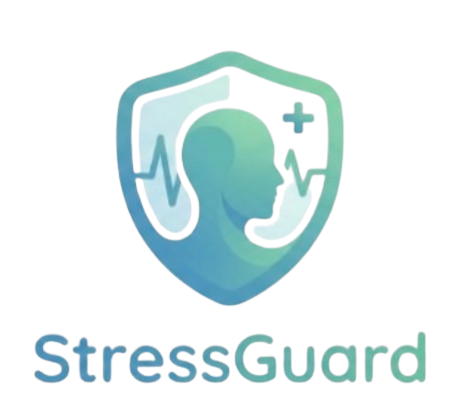

### Everyday stress awareness across your phone, watch, and web

StressGuard brings activity, sleep, heart-rate, and stress insights into one clear experience—helping users understand patterns, reflect on their well-being, and make more informed everyday choices.

---

## About StressGuard

StressGuard is a final-year project exploring how wearable data and thoughtful digital experiences can support everyday stress awareness.

Instead of presenting users with complex measurements, StressGuard turns their daily wellness information into simple summaries, meaningful trends, and timely guidance across connected devices.

## What Users Can Do

- View a clear daily wellness and stress summary.
- Follow heart-rate, activity, and sleep patterns in one place.
- Review personal history and longer-term trends.
- Receive timely high-stress alerts and check-in prompts.
- Set activity and sleep goals.
- Use Workout Mode when exercising.
- Access supportive guidance when they need a moment to reset.
- Open a web dashboard and export their own wellness reports.

## One Experience Across Three Platforms

| Platform | User experience |
|---|---|
| **Android app** | The main dashboard for daily insights, goals, history, trends, and supportive tools. |
| **Wear OS app** | Quick, glanceable updates and alerts directly from the user's wrist. |
| **Web dashboard** | A broader view of personal history, trends, and downloadable reports. |

## Designed Around the User

StressGuard focuses on an experience that is:

- **Simple** — important information is easy to understand.
- **Personal** — insights are based on the user's own wellness journey.
- **Connected** — phone, watch, and web views work together.
- **Supportive** — the product encourages reflection without creating unnecessary alarm.

## Project Status

StressGuard is an actively developed academic prototype. Features and interfaces may continue to evolve as the project is evaluated and improved.

This public repository contains the software project only. It does not contain personal wellness records from users.

## Responsible Use

StressGuard is intended for wellness awareness and academic research. It is **not a medical device**, does not provide a clinical diagnosis, and should not replace advice or care from a qualified health professional.

---

**Final Year Project · Stress awareness made more understandable**

